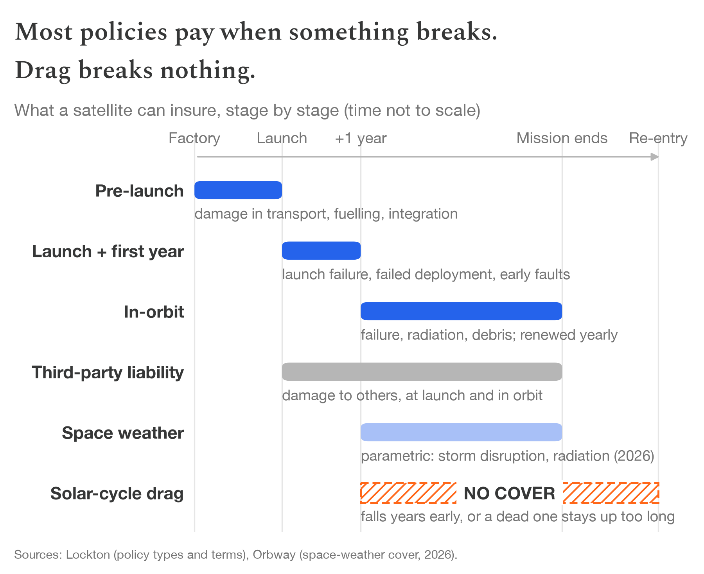
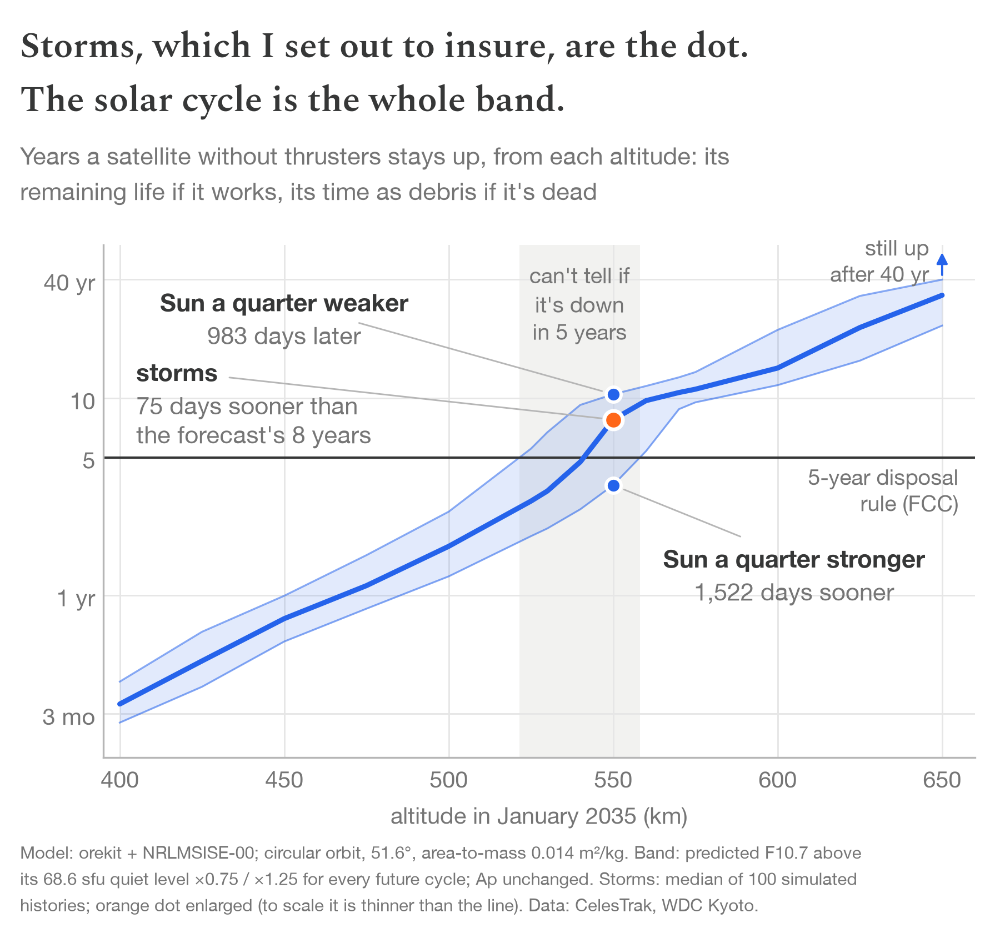
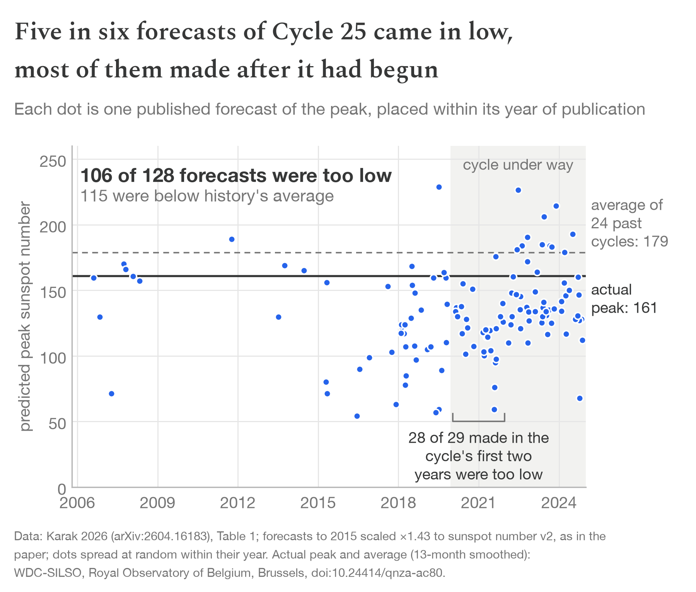
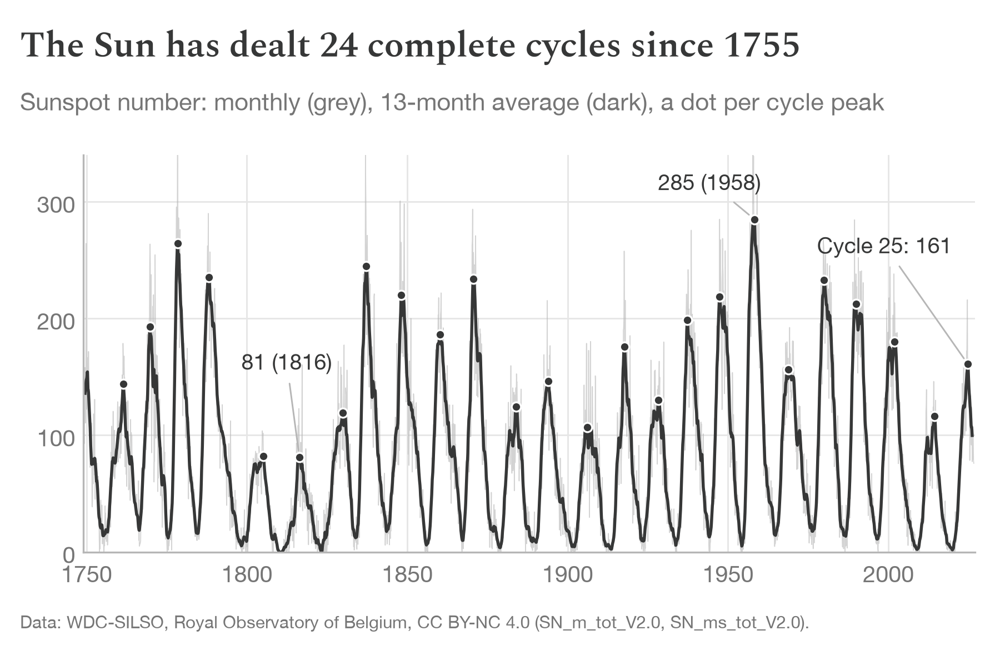

# Solar drag is uninsurable

[](https://doi.org/10.5281/zenodo.22996332)

Data and code behind the post **[Solar drag is uninsurable — and not because the risk is small](https://g15n.net/posts/solar-drag-uninsurable)**
(g15n, 2026). The article itself is in [`paper/`](paper/) (markdown and PDF), and every number and
figure in it reproduces from this repository.

> Storms, the risk I set out to insure, move a small satellite's fall by weeks. The solar
> cycle moves it by years, gives one data point every eleven years, and hits every satellite
> at once. Insurers price earthquakes by counting them; the solar cycle can barely be counted.

| | |
|---|---|
|  |  |
|  |  |

## Reproduce

Needs [pixi](https://pixi.sh). Everything else is pinned.

```bash
pixi run check      # downloads the sunspot record, recomputes every number in the post
pixi run figures    # rebuilds the four figures into figures/
```

`check` prints each claim, the value recomputed from `data/`, and `ok` or `BAD`; it exits
non-zero on any mismatch.

To recompute a point of Figure 1 from the physics (Java, orekit and a pinned ~1 GB checkout of
the orekit physics data, installed on first use):

```bash
pixi run -e model lifetime --altitude 550 --scale 1.25 --start 2035-01-16
# 550 km from 2035-01-16, solar amplitude x1.25: 3.6204 years   (data/fan.csv: 3.6204)
```

**Numerical note.** orekit-jpype is pinned to exactly 13.1.7.0, the version behind
`data/fan.csv`. The next patch release, 13.1.8.0, gives 3.5334 years for the same call: 32 days
(2.4%) shorter. Every comparison in the post is made within one version (the storm effect is
storm runs minus storm-free runs; the band is three runs of the same engine), so this shifts
all lines together rather than the gaps between them. It is still a reminder that single
lifetime numbers carry a few percent of engine uncertainty on top of everything else.

## What each claim rests on

| Claim in the post | Data | Code |
|---|---|---|
| At 550 km, typical storms bring a satellite down 17 days sooner (mission ends at solar minimum) or 75 days (maximum) | `storm_mc_550km.csv`, `storm_free_baselines_550km.csv` | `data.storm_effect_days` |
| The Sun spreads the fall over a window 3 years 5 months to 6 years 10 months wide (1,243 / 2,505 days), roughly 30–70× the storm effect; a quarter-stronger Sun alone takes ~20× what storms take | `fan.csv` | `check_numbers.py`, `lifetime_one.py` |
| For a mission ending Jan 2035, the band straddles the 5-year line at ~520–560 km | `fan.csv` | `check_numbers.py` |
| 106 of 128 forecasts too low; 28 of 29 in 2020–21; 14 of 16 in 2024 | `karak_c25_predictions.csv` | `check_numbers.py` |
| 24 complete cycles since 1755, peaks 81–285, average 179, sd a third of it | SILSO (downloaded) | `data.cycle_peaks` |
| In more than half of past cycles the peak missed the prior average by >25% | SILSO (downloaded) | `check_numbers.py` |
| About 390 intense storms (Dst < −100 nT) in almost 70 years; 367 on Riley & Ben-Nun's window to 2022 | `dst_storm_peaks.csv` | `check_numbers.py` |
| A miss on the strong side came in about one cycle in three | SILSO (downloaded) | `check_numbers.py` |
| In radio flux the default forecast is about as weak as Cycle 24; 5 of 7 radio-era cycles beat the band's strong edge | orekit-data | `check_numbers.py` (model env) |
| More than a third (1,262 of 3,451) of working satellites outside the megaconstellations fly at 500–600 km; about 280 of them government or military | `leo_payloads_2026-08-28.csv` | `check_numbers.py` |

## Method in brief

- **Lifetime model:** orekit (Apache-2.0) via orekit-jpype; semi-analytical DSST mean elements
  to 300 km, then numerical propagation to re-entry at 78 km; NRLMSISE-00 atmosphere; zonal
  gravity to J6. Checked against one real re-entry (CIRBE) as a hindcast on observed space
  weather (that check is in the research code, not reproduced here).
- **Satellite:** circular orbit, 51.6° inclination, area-to-mass 0.014 m²/kg (the median 1U
  CubeSat in Lisy 2025), no propulsion. Decay depends on the spacecraft only through this ratio.
- **Solar scenarios:** the predicted F10.7 in AGI's SpaceWeather-All file (as bundled with orekit)
  above its 68.6 sfu
  quiet level, scaled ×0.75 and ×1.25 for every future day; the observed record (to 3 June 2026)
  and geomagnetic Ap are untouched. One common factor per scenario: a coherent scenario, not a
  probability band. Cycle timing stays at the file's fixed 11 years.
- **Storm effect:** 100 simulated storm histories per case, drawn from an extreme-value fit to
  hourly Kyoto Dst (392 intense storms, Jan 1957 to Apr 2026) with a rate that follows the solar cycle; the effect is the median life lost
  against the storm-free run. The storm model itself is not part of this repository; its
  outputs are (`storm_mc_550km.csv`).
- **Forecasts:** Karak 2026, Table 1; forecasts published up to 2015 scaled ×1.43 to sunspot
  number version 2, as in the paper.

## Data sources and credit

- Sunspot numbers: WDC-SILSO, Royal Observatory of Belgium, Brussels; Clette & Lefèvre (2015),
  SILSO Sunspot Number V2.0, [doi:10.24414/qnza-ac80](https://doi.org/10.24414/qnza-ac80)
  (CC BY-NC 4.0).
- Space weather (F10.7, Ap): SpaceWeather-All v1.2, Analytical Graphics, Inc. / Center for Space
  Standards & Innovation, via orekit-data; its forecast section is NASA Marshall's mean cycle, repeated.
- Geomagnetic storms: Dst index provided by the WDC for Geomagnetism, Kyoto; Nose, Iyemori,
  Sugiura & Kamei (2015), Geomagnetic Dst index,
  [doi:10.17593/14515-74000](https://doi.org/10.17593/14515-74000) (final to 2020, provisional
  after). Scientific use only: WDC Kyoto does not allow commercial applications of its indices.
- Atmosphere: NRLMSISE-00, Picone et al. (2002),
  [doi:10.1029/2002JA009430](https://doi.org/10.1029/2002JA009430).
- Satellite catalogue: CelesTrak (Dr. T.S. Kelso).
- Cycle 25 forecasts: B. B. Karak (2026), Reviews of Modern Plasma Physics, arXiv:2604.16183, Table 1.

## Licence

Code: MIT (`LICENSE`). Text and figures: CC BY 4.0; third-party data under its own terms
(`LICENSE-CONTENT.md`).

To cite: Koehn, G. J. (2026). *Solar drag is uninsurable: article, data and code*. Zenodo.
https://doi.org/10.5281/zenodo.22996332 (this DOI always points to the latest version; see also `CITATION.cff`).
